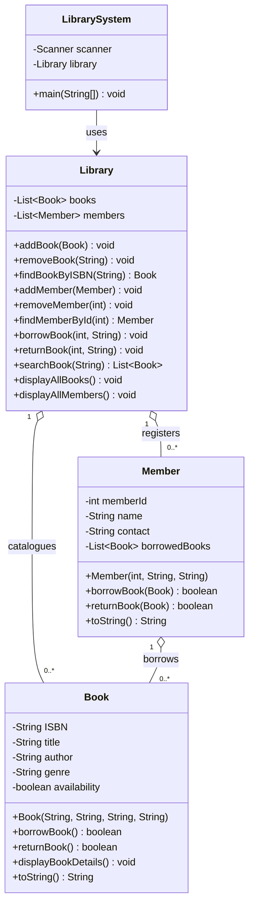
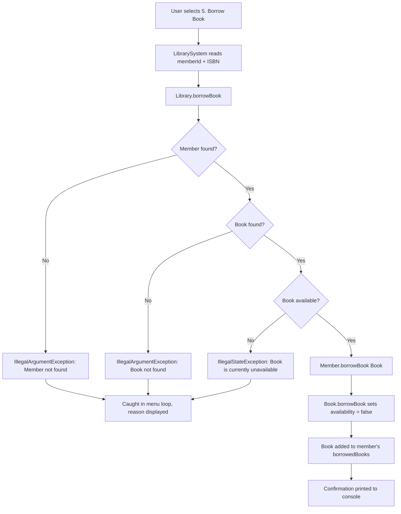

# 📚 Library Management System

A console-based Library Management System built with **Core Java**, demonstrating Object-Oriented Programming, the Collections Framework, encapsulation, input validation and exception handling — with no external frameworks or dependencies.


---

## 📖 Project Overview

**Library Management System** is a menu-driven console application that models the day-to-day operations of a small library: cataloguing books, registering members, and tracking who has borrowed what.

Managing a library manually means keeping track of which titles are on the shelf, which are checked out, and which member is holding them. Doing this on paper makes duplicate entries and lost records easy. This project solves that in software by keeping a single in-memory catalogue where every book has one owner-of-truth for its availability, and every borrow or return updates both the book and the member holding it.

The project was built as a **Core Java practice project** to demonstrate clean object-oriented design without leaning on any framework. Every rule — duplicate prevention, availability checks, validation of user input — is written in plain Java, which makes the OOP fundamentals visible rather than hidden behind annotations or configuration.

> ⚠️ **Scope note:** This is a console application with **in-memory storage only**. Data is not persisted between runs. There is no database, no web interface, and no external library of any kind.

---

## ✨ Features

All features listed below are implemented in the source code.

### Book Management
- **Add Book** — register a book with ISBN, title, author and genre
- **Remove Book** — delete a book from the catalogue by ISBN
- **Duplicate ISBN prevention** — the same ISBN cannot be added twice
- **Availability tracking** — every book carries an available / borrowed state
- **Borrowed-book protection** — a book that is currently checked out cannot be removed

### Member Management
- **Add Member** — register a member with ID, name and contact number
- **Remove Member** — delete a member by ID
- **Duplicate Member ID prevention** — the same member ID cannot be registered twice
- **Per-member borrowed list** — each member keeps their own list of borrowed books

### Library Operations
- **Borrow Book** — link a member to a book and flip the book to unavailable
- **Return Book** — return a borrowed book and restore its availability
- **Search Book** — case-insensitive partial search across **title and author**
- **Duplicate-borrow protection** — a member cannot borrow the same book twice
- **Unavailable-book protection** — a book already borrowed cannot be borrowed again

### Reports
- **View All Books** — list the full catalogue with availability status
- **View All Members** — list all registered members with their borrowed books

### Application Behaviour
- **Menu-driven console interface** with a formatted box-drawing UI
- **Sample data loading** — 3 books and 2 members are pre-loaded at startup
- **Constructor-level validation** — invalid objects can never be created
- **Re-prompting input readers** — invalid numeric or empty input is re-requested instead of crashing
- **Centralised exception handling** — the menu loop catches errors and continues running

---

## 🧠 OOP Concepts Used

| Concept | How it is demonstrated in this project |
| --- | --- |
| **Classes & Objects** | Four classes — `Book`, `Member`, `Library`, `LibrarySystem` — each with a single, distinct responsibility |
| **Encapsulation** | Every field in `Book`, `Member` and `Library` is `private` and reached only through public methods |
| **Constructors** | `Book` and `Member` use parameterised constructors that **validate before assigning**, so an invalid object cannot exist |
| **Composition (HAS-A)** | `Library` HAS-A `List<Book>` and `List<Member>`; `Member` HAS-A `List<Book>` of borrowed titles |
| **Access Modifiers** | `private` fields, `public` behaviour methods, `private static` helper methods in `LibrarySystem`, and `private static final` for the shared `Scanner` and `Library` |
| **Polymorphism (overriding)** | `Book` and `Member` both override `toString()`; calling `System.out.println(book)` dispatches to the overridden version at runtime |
| **Abstraction (interface reference)** | Collections are declared as `List<Book>` rather than `ArrayList<Book>` — coding to the interface, not the implementation |
| **Data Validation** | Business rules live inside the objects that own them, not in the UI layer |

### Encapsulation in practice

```java
private boolean availability;

public boolean borrowBook() {
    if (!availability) {
        return false;
    }
    availability = false;
    return true;
}
```

External code can never set `availability` to an invalid state directly through the borrow flow — it must go through behaviour that enforces the rule.

### Composition in practice

```java
public class Member {
    private List<Book> borrowedBooks;   // Member HAS-A list of Books
}

public class Library {
    private List<Book> books;           // Library HAS-A list of Books
    private List<Member> members;       // Library HAS-A list of Members
}
```

### Validation inside the constructor

```java
public Book(String ISBN, String title, String author, String genre) {
    if (ISBN == null || ISBN.isBlank()) {
        throw new IllegalArgumentException("ISBN cannot be empty.");
    }
    // ... title, author and genre validated the same way
    this.availability = true;
}
```

> **Honest note on abstraction:** this project does **not** define any `abstract` classes or custom `interface` types. Abstraction here is limited to programming against the `List` interface and hiding internal state behind methods. Abstract classes and interfaces are listed under *Future Enhancements*.

---

## 🏗️ Project Architecture / Class Structure

The project follows a clear separation of responsibilities: the **entity classes** hold state and their own rules, the **service class** coordinates between them, and the **UI class** talks to the user.

| Class | Layer | Responsibility |
| --- | --- | --- |
| `Book` | Entity | Holds ISBN, title, author, genre and availability. Owns `borrowBook()` / `returnBook()` availability toggles and a `displayBookDetails()` formatter. Validates its own fields on construction. |
| `Member` | Entity | Holds member ID, name, contact and the list of currently borrowed books. Owns `borrowBook(Book)` / `returnBook(Book)`, which keep the member's list and the book's availability in sync. |
| `Library` | Service | Owns the book and member collections. Handles add / remove / find / search, duplicate checks, and coordinates borrow and return by locating the right `Member` and `Book` before delegating. |
| `LibrarySystem` | UI / Entry point | `main()` method, welcome banner, menu rendering, input reading, sample data loading, and the try-catch loop that keeps the app alive when an operation fails. |

### Class Diagram



---

## 🔄 Application Flow

```text
        User
          ↓
   LibrarySystem      →  menu, input reading, error display
          ↓
      Library         →  lookup, duplicate checks, coordination
          ↓
   Book / Member      →  state changes and entity-level rules
```

**Step by step:**

1. **Start** — `LibrarySystem.main()` runs `loadSampleData()`, then prints the welcome banner.
2. **Choose** — the menu is displayed and `readInt()` reads the user's choice, re-prompting until a valid number is entered.
3. **Enter data** — the selected operation collects its inputs through `readString()` / `readInt()`, which reject empty or non-numeric input.
4. **Validate & delegate** — `LibrarySystem` constructs objects (triggering constructor validation) and calls the matching `Library` method.
5. **Execute** — `Library` locates the relevant `Book` / `Member`, enforces its own rules, and delegates the state change to the entity.
6. **Display** — the result is printed to the console. If any step threw an exception, the menu loop catches it, prints `❌ Operation Failed` with the reason, and returns to the menu instead of crashing.

### Borrow flow in detail



---

## 🛡️ Validation & Error Handling

Validation is layered: the UI rejects unusable raw input, the constructors reject invalid objects, and the service layer rejects invalid operations.

### Layer 1 — Input readers (`LibrarySystem`)

| Reader | Behaviour |
| --- | --- |
| `readInt(String)` | Loops until a parsable integer is entered; catches `NumberFormatException` and prints `Please enter a valid number.` |
| `readString(String)` | Loops until a non-empty value is entered; prints `Input cannot be empty.` and trims whitespace |

### Layer 2 — Constructor validation (entities)

| Rule | Class | Exception & message |
| --- | --- | --- |
| ISBN must not be null / blank | `Book` | `IllegalArgumentException` — *ISBN cannot be empty.* |
| Title must not be null / blank | `Book` | `IllegalArgumentException` — *Title cannot be empty.* |
| Author must not be null / blank | `Book` | `IllegalArgumentException` — *Author cannot be empty.* |
| Genre must not be null / blank | `Book` | `IllegalArgumentException` — *Genre cannot be empty.* |
| Member ID must be positive | `Member` | `IllegalArgumentException` — *Member ID must be positive.* |
| Name must not be null / blank | `Member` | `IllegalArgumentException` — *Member name cannot be empty.* |
| Contact must not be null / blank | `Member` | `IllegalArgumentException` — *Contact cannot be empty.* |

### Layer 3 — Business rules (`Library`)

| Rule | Exception & message |
| --- | --- |
| Book object must not be null | `IllegalArgumentException` — *Book cannot be null.* |
| ISBN must be unique | `IllegalArgumentException` — *Book with this ISBN already exists.* |
| Book must exist before removal | `IllegalArgumentException` — *Book not found.* |
| A borrowed book cannot be removed | `IllegalStateException` — *Cannot remove a borrowed book.* |
| Member object must not be null | `IllegalArgumentException` — *Member cannot be null.* |
| Member ID must be unique | `IllegalArgumentException` — *Member with this ID already exists.* |
| Member must exist before removal | `IllegalArgumentException` — *member not found.* |
| Member and book must both exist to borrow / return | `IllegalArgumentException` — *Member not found.* / *Book not found.* |
| Book must be available to borrow | `IllegalStateException` — *Book is currently unavailable.* |

### Layer 4 — Guarded operations (`Member`)

These return `false` and print a message rather than throwing:

- *Invalid book.* — null book passed
- *You have already borrowed this book.* — duplicate borrow by the same member
- *Book is currently unavailable.* — book already checked out
- *You have not borrowed this book.* — returning a book the member never took

### Layer 5 — Global catch in the menu loop

```java
try {
    switch (choice) { /* ... */ }
} catch (Exception e) {
    System.out.println("❌ Operation Failed");
    System.out.println("Reason: " + e.getMessage());
}
```

Any exception thrown anywhere below the menu is caught here, reported in a readable form, and the application returns to the menu instead of terminating. `loadSampleData()` is wrapped in its own try-catch so a startup data problem cannot prevent the app from launching.

---

## 🛠️ Technologies Used

| Technology | Purpose |
| --- | --- |
| **Java (11+)** | Core programming language — `String.isBlank()` requires Java 11 or higher |
| **Object-Oriented Programming** | Application design: entities, service layer and UI layer |
| **`java.util.ArrayList`** | Concrete in-memory storage for books, members and borrowed books |
| **`java.util.List`** | Interface type used for all collection references |
| **`java.util.Scanner`** | Reading user input from the console |
| **Exception Handling** | `IllegalArgumentException`, `IllegalStateException`, `NumberFormatException` for validation and error reporting |
| **`String.format` / `printf`** | Aligned, box-formatted console output |

No build tool, external library or framework is used — the project compiles with `javac` alone.

---

## 📁 Project Structure

```text
Library-Management-System/
│
├── Book.java              # Entity — book data, availability, self-validation
├── Member.java            # Entity — member data, borrowed books list
├── Library.java           # Service — collections, lookup, business rules
├── LibrarySystem.java     # Main class — menu, input handling, sample data
├── leaderboard.txt        # Unrelated leftover file (not read by any class)
└── README.md
```

All four classes declare `package week_3_task_project;`, so they must sit inside a folder named `week_3_task_project` to compile and run:

```text
week_3_task_project/
├── Book.java
├── Member.java
├── Library.java
└── LibrarySystem.java
```

> **Note:** `leaderboard.txt` is not referenced anywhere in the source — the project performs no file I/O (`java.io` is never imported).

---

## 🚀 How to Run the Project

### Prerequisites

- **JDK 11 or higher** — the code uses `String.isBlank()`, introduced in Java 11
- A terminal or IDE (Eclipse, IntelliJ IDEA, VS Code)
- A **UTF-8 capable console** — the menu uses box-drawing characters and emoji

### Option A — Run from the command line

```bash
# 1. Clone the repository
git clone https://github.com/sm7602/Library-Management-System.git
cd Library-Management-System

# 2. Place the sources in a folder matching the package name
mkdir -p week_3_task_project
mv *.java week_3_task_project/

# 3. Compile (UTF-8 flag preserves the box-drawing menu characters)
javac -encoding UTF-8 week_3_task_project/*.java

# 4. Run
java week_3_task_project.LibrarySystem
```

**On Windows,** switch the console to UTF-8 first so the menu renders correctly:

```bat
chcp 65001
javac -encoding UTF-8 week_3_task_project\*.java
java week_3_task_project.LibrarySystem
```

> **Alternative:** if you prefer a flat structure, delete the `package week_3_task_project;` line from all four files, then run `javac -encoding UTF-8 *.java` followed by `java LibrarySystem`.

### Option B — Run from an IDE

1. Install a **JDK 11+**.
2. Create a new Java project.
3. Create a package named `week_3_task_project` and place all four `.java` files inside it.
4. Confirm the package declaration at the top of each file matches the package folder.
5. Set the project encoding to **UTF-8** (Eclipse: *Project → Properties → Resource → Text file encoding*).
6. Right-click `LibrarySystem.java` → **Run As → Java Application**.
7. Interact with the menu in the console view.

---

## 💻 Sample Console Output

### Startup

The three sample books and two sample members are loaded before the banner appears, so their confirmation lines are the first thing printed:

```text
Book added successfully.
Book added successfully.
Book added successfully.
Member added successfully.
Member added successfully.

╔══════════════════════════════════════════════╗
║                                              ║
║       📚 WELCOME TO LIBRARY SYSTEM 📚        ║
║                                              ║
║     Manage Books • Members • Borrowing       ║
║                                              ║
╚══════════════════════════════════════════════╝

╔════════════════════════════════════════════════════╗
║           📚 LIBRARY MANAGEMENT SYSTEM             ║
╠════════════════════════════════════════════════════╣
║                                                    ║
║  BOOK MANAGEMENT                                   ║
║  1. Add Book                                       ║
║  2. Remove Book                                    ║
║                                                    ║
║  MEMBER MANAGEMENT                                 ║
║  3. Add Member                                     ║
║  4. Remove Member                                  ║
║                                                    ║
║  LIBRARY OPERATIONS                                ║
║  5. Borrow Book                                    ║
║  6. Return Book                                    ║
║  7. Search Book                                    ║
║                                                    ║
║  REPORTS                                           ║
║  8. View All Books                                 ║
║  9. View All Members                               ║
║  0. Exit                                           ║
║                                                    ║
╚════════════════════════════════════════════════════╝
Enter your choice: 8
```

### Viewing all books

```text
========== ALL BOOKS ==========

========== ALL BOOKS ==========
Book{isbn='9780134685991', title='Effective Java', author='Joshua Bloch', genre='Programming', availability=true}
Book{isbn='9780132350884', title='Clean Code', author='Robert C. Martin', genre='Programming', availability=true}
Book{isbn='9781617294945', title='Spring in Action', author='Craig Walls', genre='Spring', availability=true}

Press ENTER to continue...
```

### A failed operation

```text
========== REMOVE BOOK ==========
Enter ISBN: 9780132350884

❌ Operation Failed
Reason: Cannot remove a borrowed book.

Press ENTER to continue...
```

---

## 🧪 Example Operations

### 1. Adding a book

```text
Enter your choice: 1

========== ADD BOOK ==========
Enter ISBN: 9780596009205
Enter title: Head First Java
Enter author: Kathy Sierra
Enter genre: Programming
Book added successfully.

✅ Book added successfully!
```

### 2. Adding a member

```text
Enter your choice: 3

========== ADD MEMBER ==========
Enter member ID: 103
Enter member name: Ananya Sharma
Enter contact number: 9812345670
Member added successfully.

✅ Member added successfully!
```

### 3. Borrowing a book

```text
Enter your choice: 5

========== BORROW BOOK ==========
Enter member ID: 101
Enter book ISBN: 9780132350884
Book borrowed successfully: Clean Code
Book borrowed successfully by Souvik

╔══════════════════════════════════════════════╗
║       ✅ BOOK BORROWED SUCCESSFULLY          ║
╠══════════════════════════════════════════════╣
║ Member : Souvik                              ║
║ Book   : Clean Code                          ║
║ ISBN   : 9780132350884                       ║
╚══════════════════════════════════════════════╝
```

### 4. Returning a book

```text
Enter your choice: 6

========== RETURN BOOK ==========
Enter member ID: 101
Enter book ISBN: 9780132350884
Book returned successfully: Clean Code
Book returned successfully.

✅ Book returned successfully!
```

### 5. Searching for a book

Search matches **partial, case-insensitive** text in the title **or** the author:

```text
Enter your choice: 7

========== SEARCH BOOK ==========
Enter title or author : java

🔎 Search Results
-----------------------------------------------
Book{isbn='9780134685991', title='Effective Java', author='Joshua Bloch', genre='Programming', availability=true}
Book{isbn='9780596009205', title='Head First Java', author='Kathy Sierra', genre='Programming', availability=true}
-----------------------------------------------
Total results: 2
```

### 6. Duplicate ISBN rejected

```text
========== ADD BOOK ==========
Enter ISBN: 9780134685991
Enter title: Effective Java
Enter author: Joshua Bloch
Enter genre: Programming

❌ Operation Failed
Reason: Book with this ISBN already exists.
```

---

## 🎓 Key Learning Outcomes

Building or reading this project covers the ground a Java developer needs before moving to frameworks:

| Area | What it teaches |
| --- | --- |
| **OOP fundamentals** | Modelling a real-world domain as classes with clear responsibilities |
| **Encapsulation** | Why private state plus behaviour methods beats public fields, and how it prevents invalid states |
| **Object relationships** | Building HAS-A relationships between `Library`, `Member` and `Book`, and keeping both sides of a borrow in sync |
| **Collections Framework** | Practical `ArrayList` / `List` use — iterating, searching, adding, removing, and coding to the interface |
| **Constructor validation** | The "fail fast" idea: reject bad data at creation time instead of checking everywhere afterwards |
| **Exception handling** | Choosing between `IllegalArgumentException` (bad input) and `IllegalStateException` (wrong state), and where to catch |
| **Defensive input handling** | Loop-and-retry input readers that survive anything a user types |
| **Separation of responsibilities** | Keeping UI code (`LibrarySystem`) out of business logic (`Library`) and entities (`Book`, `Member`) |
| **Console UX** | `printf` formatting, aligned output, and readable menu design |

---

## 🔮 Future Enhancements

> ⚠️ **None of the items below are implemented.** They are planned improvements, listed to show the intended direction of the project. Everything described in the *Features* section above **is** implemented; everything here is **not**.

| Enhancement | Description |
| --- | --- |
| **Persistence** | Save state to file or a MySQL/PostgreSQL database so data survives restarts |
| **Spring Boot REST API** | Expose the library operations as HTTP endpoints |
| **Unit testing (JUnit 5)** | Test coverage for validation rules, borrow/return logic and search |
| **User authentication** | Login for librarians and members |
| **Admin / member roles** | Restrict destructive operations to administrators |
| **Due dates & fines** | Track issue dates, due dates and calculate late fees |
| **Borrowing limits** | Cap the number of books a single member can hold |
| **Return integrity** | Prevent removing a member who still holds borrowed books |
| **Richer search** | Search by ISBN and genre, plus filtering and pagination |
| **Interfaces & abstract classes** | Introduce a `LibraryItem` abstraction to support magazines, DVDs and other media |
| **Logging** | Replace `System.out.println` with SLF4J / Log4j2 |
| **Transaction history** | Audit trail of every borrow and return |
| **GUI or web interface** | JavaFX desktop client or a web front end |

---

## 📸 Screenshots

*Screenshots to be added.*

### Main Menu


### Book Management


### Borrow / Return Operation


---

## 👤 Author

**Souvik Maity**
*Java Backend Developer*

[](https://github.com/sm7602)
[](https://www.linkedin.com/in/souvik-maity-2a6759333)

- GitHub: [https://github.com/sm7602](https://github.com/sm7602)
- LinkedIn: [https://www.linkedin.com/in/souvik-maity-2a6759333](https://www.linkedin.com/in/souvik-maity-2a6759333)

---

## 📄 License

No license file is included in this repository.

> This project is currently available for educational and portfolio purposes.

---

<div align="center">

⭐ If you found this project useful, consider starring the repository.

</div>
